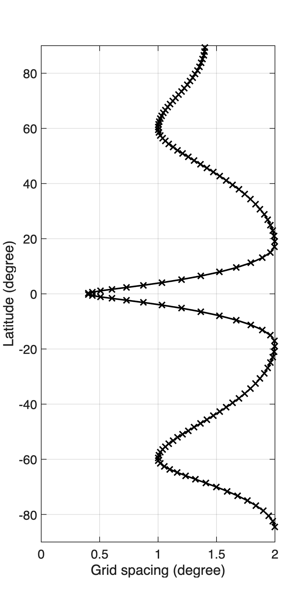
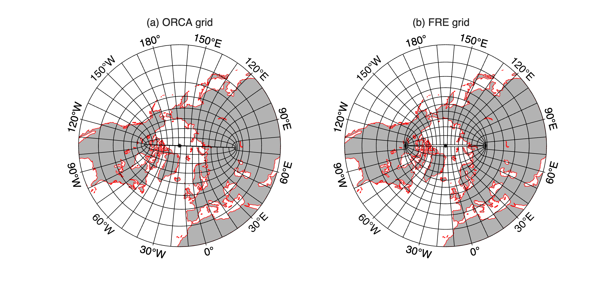

# Supergrid

## About

The supergrid of the `tx2_0` configuration is created using [FRE-NCtools](https://github.com/NOAA-GFDL/FRE-NCtools)
(instead of `ORCA_gridgen` used in the `tx2_3` configuration). The size of the supergrid is `NX = 360` and `NY = 256`.
In the zonal direction, the T-grid has a uniform resolution of 2&deg;. In the meridional direction, the T-grid starts
at 85.5&deg; in order to skip the land points in the Antarctica. It has a variable resolution with refinements at the
Equator and 60&deg;. The target meridional resolutions for the T-grid at different latitudes are given by

| Latitude     | 85.5&deg;S | 60&deg;S | 18&deg;S | 0&deg;   | 18&deg;N | 60&deg;N | 90&deg;N |
| :---:        | :---:      | :---:    | :---:    | :---:    | :---:    | :---:    | :---:    |
| Grid spacing | 2.0&deg;   | 1.0&deg; | 2.0&deg; | 0.4&deg; | 2.0&deg; | 1.0&deg; | 1.4&deg; |

<p align="center">
  <br>
  <strong>Figure 1: Meridional grid spacing as a function of latitude.</strong>
</p>

<p align="center">
  <br>
  <strong>Figure 2: Comparison of ORCA grid and FRE grid in the Northern Hemisphere.</strong>
</p>

## Usage

1. Download and install [FRE-NCtools](https://github.com/NOAA-GFDL/FRE-NCtools). Module needed for installation: `nco`.

2. Create a symbolic link of `make_hgrid` in the directory where you want to generate the grid.

3. Generate `ocean_hgrid.nc` using `make_hgrid`:
   ```
   ./make_hgrid --grid_type tripolar_grid --nxbnd 2 --nybnd 7 --xbnd -285,75 --dlon 2.0,2.0 \
   --ybnd -85.5,-60,-18,0,18,60,90 --dlat 2.0,1.0,2.0,0.4,2.0,1.0,1.4 --lat_join 60 \
   --grid_name ocean_hgrid --center t_cell
   ```

4. Change units to degrees
   ```
   ncatted -O -a units,x,m,c,degrees ocean_hgrid.nc
   ncatted -O -a units,y,m,c,degrees ocean_hgrid.nc
   ```
